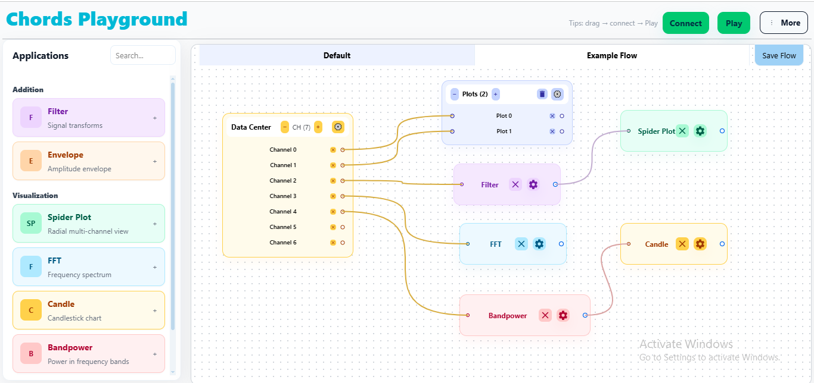

# 📊 Widget Dashboard - Modular System



A modular, drag-and-drop widget dashboard built with **Next.js**, **TypeScript**, and **Tailwind CSS**. Originally a 1000+ line monolithic component, now restructured into 8 clean, maintainable modules.

## ✔ Best scalable pattern (Used in Node-RED, LabVIEW, MaxMSP, BioSignal tools)

Signal routing is per-channel, not per-node.

Meaning:

- Every processing node consumes one channel.

- If a user wants 4 channels → they drag 4 BandPower nodes (one per channel).

This avoids:

- Cross-channel interference

- Timing mismatches

- Buffer alignment issues

- UI complexity

- Routing errors

Why this is good for our application:

- Clarity & single responsibility: Each processing node handles one channel, making it easy to reason about state and behavior.
- Independent timing & buffers: Per-channel nodes use their own buffers and internal state, avoiding accidental misalignment when channels start or stop.
- Easy debugging and configuration: Users can tweak band, window, or filter settings per-channel without affecting others.
- Scalable UI: The flow and dashboard stay predictable — adding or removing channels is explicit and localized.
- Compatibility with existing architecture: Our provider already applies per-channel filters and widgets prefer published outputs from single-source nodes, so this pattern maps naturally to the codebase.

Recommendation summary: favor one processing node per channel for most use-cases; only consolidate into multi-channel nodes when you need tight, optimized, or algorithmically coupled multi-channel processing (e.g., beamforming, PCA).

## 🚀 Quick Start

```bash
# Install dependencies
npm install

# Run development server
npm run dev

# Open in browser
# http://localhost:3000
```

## 📁 Project Structure

```
src/
├── app/
│   ├── docs/           # 📚 Complete project documentation
│   ├── widgets/        # 🎛️ Main dashboard (300 lines)
│   └── page.tsx        # 🏠 Homepage
├── components/
│   ├── ui/             # 🎨 Reusable UI components
│   ├── DraggableWidget.tsx    # 🖱️ Individual widget (330 lines)
│   ├── WidgetPalette.tsx      # 🎛️ System controls (260 lines)
│   └── [charts].tsx    # 📊 Chart components
├── types/
│   └── widget.types.ts # 📝 TypeScript definitions (50 lines)
└── utils/
    └── widget.utils.ts # 🔧 Utilities (116 lines)
```

## ✨ Key Features

- **🖱️ Drag & Drop**: Intuitive widget positioning with collision detection
- **📈 Real-time Charts**: WebGL-powered Signal, FFT, Radar, and Bar charts
- **🔧 Modular Design**: Clean architecture with single-responsibility components
- **💾 Import/Export**: Save and load dashboard layouts as JSON files
- **🎯 Channel Management**: Up to 6 channels per signal widget
- **📱 Responsive**: Adaptive UI that works on different screen sizes

## 📚 Quick Reference

Key files and their purposes:

- `src/app/widgets/page.tsx` - Main dashboard component (~300 lines)
- `src/components/DraggableWidget.tsx` - Individual widget logic (~330 lines)
- `src/components/WidgetPalette.tsx` - System controls (~260 lines)
- `src/types/widget.types.ts` - TypeScript definitions (~50 lines)
- `src/utils/widget.utils.ts` - Utility functions (~116 lines)

## 🛠️ Tech Stack

- **Framework**: Next.js 14+ with App Router
- **Language**: TypeScript with strict typing
- **Styling**: Tailwind CSS
- **Charts**: WebGL Plot for high-performance visualization
- **State Management**: React Hooks (useState, useCallback, useMemo)

## 🎯 Architecture Benefits

✅ **Maintainable**: 8 focused files instead of 1 monolithic component  
✅ **Testable**: Isolated components with clear interfaces  
✅ **Performant**: Memoized components and efficient re-rendering  
✅ **Extensible**: Easy to add new widget types and features  
✅ **Type-Safe**: Full TypeScript coverage prevents runtime errors

## Learn More

To learn more about Next.js, take a look at the following resources:

- [Next.js Documentation](https://nextjs.org/docs) - learn about Next.js features and API.
- [Learn Next.js](https://nextjs.org/learn) - an interactive Next.js tutorial.

You can check out [the Next.js GitHub repository](https://github.com/vercel/next.js) - your feedback and contributions are welcome!

## Deploy on Vercel

The easiest way to deploy your Next.js app is to use the [Vercel Platform](https://vercel.com/new?utm_medium=default-template&filter=next.js&utm_source=create-next-app&utm_campaign=create-next-app-readme) from the creators of Next.js.

Check out our [Next.js deployment documentation](https://nextjs.org/docs/app/building-your-application/deploying) for more details.
